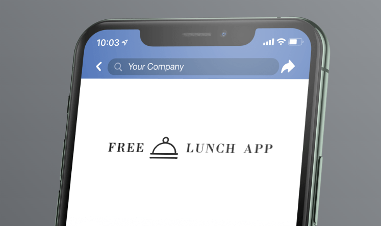

# Free Lunch - Backend




[Database schema](https://dbdiagram.io/d/Free-lunch-app-65db99b65cd0412774c4b037)


## Description:

The Free Lunch App Backend is the server-side for a mobile application aimed at facilitating the management and distribution of free lunches within organizations or communities. This backend system is responsible for handling user authentication, managing organizations, processing lunch requests, tracking user balances, and handling withdrawals.

## Key Features:

- **User Management**: Allows users to register, login, and manage their profiles.
- **Organization Management**: Enables the creation, modification, and deletion of organizations.
- **Lunch Distribution**: Facilitates the sending and receiving of lunch requests between users within organizations.
- **Wallet Management**: Tracks user lunch credit balances and handles withdrawals.
- **Invitation System**: Provides functionality for inviting users to join organizations.
- **Security**: Implements secure authentication mechanisms and data encryption to ensure user privacy and data integrity.


## Getting Started

First, run the development server:

```bash
npm run dev
# or
yarn dev
# or
pnpm dev
```

The following log message should be displayed in console output:

```bash
2023-04-17 23:14:38 PM [info] : Server started at http://localhost:8080
```

> Note!! If the schema was updated, run the following command to apply the updated changes: `yarn run dbPush` or `npm run dbPush`

Visit `http://localhost:8080/api/user/data` in your browser just to confirm routes are configured and working properly. If all is working properly, you should get the below response on browser.

```js
{
  "message": "user data fetched successfully",
  "statusCode": 200,
  "data": [
    {
      "name": "john doe",
      "email": "john@mail.com"
    },
    {
      "name": "brain tracy",
      "email": "brian@mail.com"
    }
  ]
}
```

## Environmental Variable

Create a .env file inside the root of your application and include the following content:

```bash
DATABASE_URL='mysql://root:@localhost:<add_your_port || 3306>/free-lunch'

NODE_ENV="development"

JWT_SECRET="sdcsdcdc32ry38y9dpnp23i3892te832tp9e23on"
```

> Note!! you need to create the database `free-lunch` yourself before doing any other thing within the app if you need it to work properly. You could use tool like `PhpMyAdmin` or `MysqlWorkBench`

# Routes

The routes can be found within the `/routes` directory. for eg the user route would handle routing that has to do with the user controllers which is prefix with `/user/*` and when been invoked, would be done in this format `/api/user/*`

```js
const express = require("express");
const UserController = require("../controller/user");
const useCatchErrors = require("../error/catchErrors");

class UserRoute {
  router = express.Router();
  userController = new UserController();
  path = "/user";

  constructor() {
    this.initializeRoutes();
  }

  initializeRoutes() {
    this.router.get(
      `${this.path}/data`,
      useCatchErrors(this.userController.getUser.bind(this.userController))
    );
  }
}

module.exports = UserRoute;
```

Also, within each controller file, notice that `try...catch` isn't been used, this is because I've created an `error method` called `useCatchErrors` which would handle all exceptions / error thrown within any controller file.

> `Do Not Touch the Base file within the controller directory. It should only be inherited from.`

# Commit Standards

## Branches

- **dev** -> pr this branch for everything `frontend` & `backend` related
- **main** -> **dont touch** this branch, this is what is running in production.

## Contributions

Free Lunch is open to contributions, but I recommend creating an issue or replying in a comment to let us know what you are working on first that way we don't overwrite each other.

## Contribution Guidelines

1. Clone the repo `git clone https://github.com/Uzo-Felix/free_lunch_backend`.
2. Open your terminal & set the origin branch: `git remote add origin https://github.com/Uzo-Felix/free_lunch_backend.web.git`
3. Pull origin `git pull origin dev`
4. Create a new branch for the task you were assigned to, eg : `git checkout -b feat-csv-parser`
5. After making changes, do `git add .`
6. Commit your changes with a descriptive commit message : `git commit -m "your commit message"`.
7. To make sure there are no conflicts, run `git pull upstream dev`.
8. Push changes to your new branch, run `git push -u origin feat-csv-parser`.
9. Create a pull request to the `dev` branch not `main`.
10. Ensure to describe your pull request.
11. > If you've added code that should be tested, add some test examples.

### _Commit CheatSheet_

| Type     |                          | Description                                                                                                 |
| -------- | ------------------------ | ----------------------------------------------------------------------------------------------------------- |
| feat     | Features                 | A new feature                                                                                               |
| fix      | Bug Fixes                | A bug fix                                                                                                   |
| docs     | Documentation            | Documentation only changes                                                                                  |
| style    | Styles                   | Changes that do not affect the meaning of the code (white-space, formatting, missing semi-colons, etc)      |
| refactor | Code Refactoring         | A code change that neither fixes a bug nor adds a feature                                                   |
| perf     | Performance Improvements | A code change that improves performance                                                                     |
| test     | Tests                    | Adding missing tests or correcting existing tests                                                           |
| build    | Builds                   | Changes that affect the build system or external dependencies (example scopes: gulp, broccoli, npm)         |
| ci       | Continuous Integrations  | Changes to our CI configuration files and scripts (example scopes: Travis, Circle, BrowserStack, SauceLabs) |
| chore    | Chores                   | Other changes that don't modify backend, frontend or test files                                             |
| revert   | Reverts                  | Reverts a previous commit                                                                                   |

> _Sample Commit Messages_

- `chore: Updated README file` := `chore` is used because the commit didn't make any changes to the backend, frontend or test folders in any way.
- `feat: Added plugin info endpoints` := `feat` is used here because the feature was non-existent before the commit.
